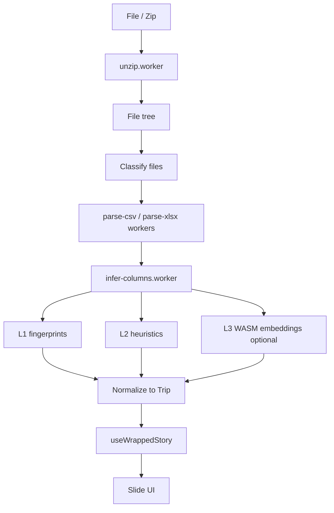

# Ride Wrapped — Design Spec

**Status:** Approved (2026-05-30)  
**Hero outcome:** Shareable “year in rides” story (Spotify Wrapped vibe)  
**Framework:** Nuxt 4  
**Privacy:** No login, no auth, no server-side processing of user exports

---

## 1. Problem & product

Users export trip data from ride apps (Uber, Ola, Rapido, etc.) as CSV, XLSX, or ZIP archives with inconsistent folder names, file names, and column headers. Ride Wrapped turns that export into a **short, full-screen, shareable story** (stats + personality + export image)—entirely in the browser.

### Non-goals (v1)

- User accounts or cloud storage of trips
- Server-side parsing or upload APIs
- Multi-provider comparison as a primary UX
- Generative LLM copy for slides
- Live maps or geocoding APIs

### Success criteria

1. User uploads a supported export without creating an account.
2. App produces a 6–8 slide story with at least total trips and total spend when data exists.
3. User can download a share image (1080×1920 and/or 1080×1080).
4. No user trip data is sent to application servers.

---

## 2. User journey


| Step | Route | Purpose |
|------|-------|---------|
| Landing | `/` | Value prop, privacy promise, CTA |
| Upload | `/upload` | Drop zone, progress, errors |
| Map (conditional) | `/map` | Confirm column mapping only when needed |
| Story | `/wrapped` | Full-screen slide player |
| Share | Finale on `/wrapped` | Download composite PNG |

**Auto-skip `/map`** when provider fingerprint or heuristics confidence ≥ configured threshold (default 0.85) and at least one trip row parses successfully.

---

## 3. Architecture

### 3.1 Rendering

| Route group | Mode | Notes |
|-------------|------|-------|
| `/` | Prerender (SSG) | SEO, OG meta via `@nuxtjs/seo` |
| `/upload`, `/map`, `/wrapped` | Client-only (`ssr: false` via `routeRules`) | File API, Workers, optional WASM |

Deploy as static output (`nuxt generate`) to any static host. No Nitro routes process uploads. Optional `server/routes/health.get.ts` for deploy probes only.

### 3.2 Processing pipeline (browser)



All heavy work runs in **Web Workers**. Main thread: UI, orchestration, share image generation.

### 3.3 Inference strategy (hybrid)

1. **L1 — Provider fingerprints:** Known export layouts (file names, path segments, exact or near-exact header sets) for Uber, Ola, Rapido (India-first).
2. **L2 — Heuristics:** Header synonym tables, fuzzy match, sample-row type inference (datetime, currency, lat/lng).
3. **L3 — WASM embeddings (lazy):** Small sentence embedding model (e.g. MiniLM via `transformers.js` / ONNX) for column-to-canonical-field similarity when L1/L2 confidence is low.

**Personality labels** on slides use **deterministic rules** on aggregated stats (not generative AI).

User confirmation UI on `/map` shows proposed mappings with confidence; user can override before story generation.

---

## 4. Data model

### 4.1 Canonical `Trip` (`shared/types/trip.ts`)

| Field | Type | Required for story |
|-------|------|----------------------|
| `provider` | `'uber' \| 'ola' \| 'rapido' \| 'unknown'` | No |
| `startedAt` | `Date` | Yes (for year range, time slides) |
| `endedAt` | `Date \| null` | No |
| `pickup` | `string \| null` | For place slide |
| `dropoff` | `string \| null` | No |
| `fare` | `number \| null` | For money slide |
| `currency` | `string \| null` | Display |
| `distanceKm` | `number \| null` | Optional slide |
| `status` | `string \| null` | Filter cancelled |
| `vehicleType` | `string \| null` | No |
| `sourceFile` | `string` | Debug / merge |

### 4.2 `StorySlide` (`shared/types/story.ts`)

```ts
type StorySlideKind =
  | 'hook'
  | 'stat'
  | 'highlight'
  | 'personality'
  | 'cta'

type StorySlide = {
  id: string
  kind: StorySlideKind
  headline: string
  subline?: string
  value?: string
  visual?: 'number' | 'gradient' | 'emoji'
}
```

### 4.3 Import types (`shared/types/import.ts`)

- `FileNode`: `{ path: string; name: string; kind: 'csv' | 'xlsx' }`
- `ParsedTable`: `{ headers: string[]; rows: string[][]; source: FileNode }`
- `ColumnMapping`: canonical field → source column index + confidence
- `ImportResult`: `{ trips: Trip[]; warnings: string[]; provider: string }`

---

## 5. Story content (v1 slides)

Fixed order; **omit slide** if required fields missing (never show empty or NaN).

| # | Kind | Content | Data dependency |
|---|------|---------|-----------------|
| 1 | hook | “Your rides, wrapped” + year | `startedAt` range |
| 2 | stat | Total trips | count trips |
| 3 | stat | Total spend | `fare` sum |
| 4 | stat | Busiest month or weekday | `startedAt` histogram |
| 5 | stat | Top pickup area | normalized `pickup` token (city/area heuristic) |
| 6 | highlight | Longest or priciest trip | distance or fare |
| 7 | personality | Rule-based label | stats thresholds |
| 8 | cta | Share + upload again | none |

**Personality examples (rules):** Night Owl (≥40% trips 22:00–05:00), Airport Regular (pickup/drop contains “airport”), Weekend Warrior, etc.

---

## 6. Nuxt 4 project structure

```
ride-wrapped/
├── app/
│   ├── pages/
│   │   ├── index.vue
│   │   ├── upload.vue
│   │   ├── map.vue
│   │   └── wrapped.vue
│   ├── layouts/
│   │   ├── default.vue
│   │   └── wrapped.vue
│   ├── components/
│   │   ├── ride/          # business + data-testid
│   │   └── wrapped/
│   └── ui/                # shadcn primitives, NO data-testid
│   ├── composables/
│   │   ├── useRideImport.ts
│   │   ├── useColumnMap.ts
│   │   ├── useTripNormalize.ts
│   │   ├── useWrappedStory.ts
│   │   └── useWrappedShare.ts
│   ├── workers/
│   │   ├── unzip.worker.ts
│   │   ├── parse-csv.worker.ts
│   │   ├── parse-xlsx.worker.ts
│   │   └── infer-columns.worker.ts
│   └── plugins/
│       └── wasm-inference.client.ts
├── shared/
│   ├── types/
│   ├── constants/
│   │   ├── providers.ts      # fingerprints
│   │   └── column-synonyms.ts
│   └── lib/
│       ├── normalize-trips.ts
│       ├── wrapped-stats.ts
│       └── personality.ts
├── public/
│   └── models/               # optional lazy WASM assets
├── nuxt.config.ts
└── package.json
```

---

## 7. UI & accessibility

- **shadcn-vue** (or equivalent) for primitives under `app/components/ui/`.
- **data-testid** only on `app/components/ride/*` and `app/components/wrapped/*` per project contract (`ride-upload-dropzone`, `ride-mapping-confirm`, `wrapped-share-download`, etc.).
- Story player: keyboard arrows, swipe on touch, `prefers-reduced-motion` disables non-essential animations.
- **`useAnnouncer`** (Nuxt 4) for slide changes.

---

## 8. Share export

- Formats: **1080×1920** (default), **1080×1080** (toggle on CTA slide).
- Implementation: `html-to-image` or canvas from a dedicated share template component (client-only).
- Filename: `ride-wrapped-YYYY.png`.

---

## 9. Input handling

| Input | Behavior |
|-------|----------|
| Single `.csv` / `.xlsx` | Parse directly |
| `.zip` | Unzip in worker; walk tree; collect all csv/xlsx |
| Nested folders | Use full relative path for provider hints |
| Multiple trip files | Merge; dedupe by `(startedAt ISO + pickup + fare)` hash |
| Non-trip files | Skip (invoices, empty sheets) via classify step |

**Size limits (v1):** Reject or warn above 50 MB zip / 20 MB single file; stream parse where possible.

---

## 10. Error handling

| Condition | User message / action |
|-----------|------------------------|
| No csv/xlsx in zip | “No trip files found—try your app’s trip export.” |
| 0 trips after parse | Same + link to help |
| Low mapping confidence | Route to `/map` |
| Partial fare/date | Story skips money/time slides; show warning toast once |
| Worker crash | Retry upload; log to console only |

---

## 11. Privacy & trust

- Landing and upload: explicit copy that files stay on device.
- No analytics that include trip content in v1 (optional privacy-friendly page views only).
- Open-source fingerprints/synonyms where possible.
- Optional IndexedDB session (post-v1): store normalized `Trip[]` locally for revisit without re-upload.

---

## 12. Dependencies (planned)

| Package | Use |
|---------|-----|
| `nuxt` ^4 | Framework |
| `fflate` or `jszip` | Zip in worker |
| `papaparse` | CSV streaming |
| `xlsx` (read-only) | XLSX headers + rows |
| `@vueuse/nuxt` | file dialog, gestures |
| `@pinia/nuxt` | optional import session state |
| `@nuxtjs/seo` | landing meta |
| `html-to-image` | share PNG |
| `@xenova/transformers` | optional L3 embeddings (lazy) |

---

## 13. Testing strategy

- **Unit (Vitest):** `normalize-trips`, `wrapped-stats`, `personality`, fingerprint matching, column heuristics—fixture CSV headers per provider.
- **Worker tests:** Parse sample files from `tests/fixtures/`.
- **E2E (Playwright):** Upload fixture zip → story visible → share button triggers download (client route with mock file).

---

## 14. MVP delivery checklist

- [ ] Nuxt 4 scaffold with `app/` + `shared/`
- [ ] Landing + upload + wrapped routes
- [ ] Worker pipeline: unzip → parse → infer → normalize
- [ ] 2–3 provider fingerprints + `/map` fallback
- [ ] 6–8 slides with skip-if-missing
- [ ] Share PNG download
- [ ] Privacy copy on landing/upload

---

## 15. Export format reference (no personal files)

Provider layouts are documented in **`docs/ride-data-format.md`** (folder tree + column lists only).

Fingerprints are implemented in `shared/constants/providers.ts`. Tests use **synthetic rows** in `tests/fixtures/uber-rider-trips-sample.csv` (fake addresses/times; real header names).

### Uber (documented)

| Rule | Value |
|------|--------|
| Trip file | `Rider/trips_data-*.csv` |
| Ignore | `Eats/*`, `Account and Profile/*`, analytics, ratings, profile, orders |
| Time | `begintrip_timestamp_local` → `dropoff_timestamp_local` |
| Money | `fare_amount` + `currency_code` |
| Places | `begintrip_address`, `dropoff_address` |
| Distance | `trip_distance_miles` → km in normalize step |

Ola and Rapido: add sections to `ride-data-format.md` when available; same fingerprint pipeline applies.

---

## 16. Future (post-v1)

- IndexedDB “come back to my wrapped”
- More providers / locales
- Multi-provider story (“You split time between Uber and Ola”)
- PWA offline
- WASM embeddings enabled by default after metrics on failure rate
